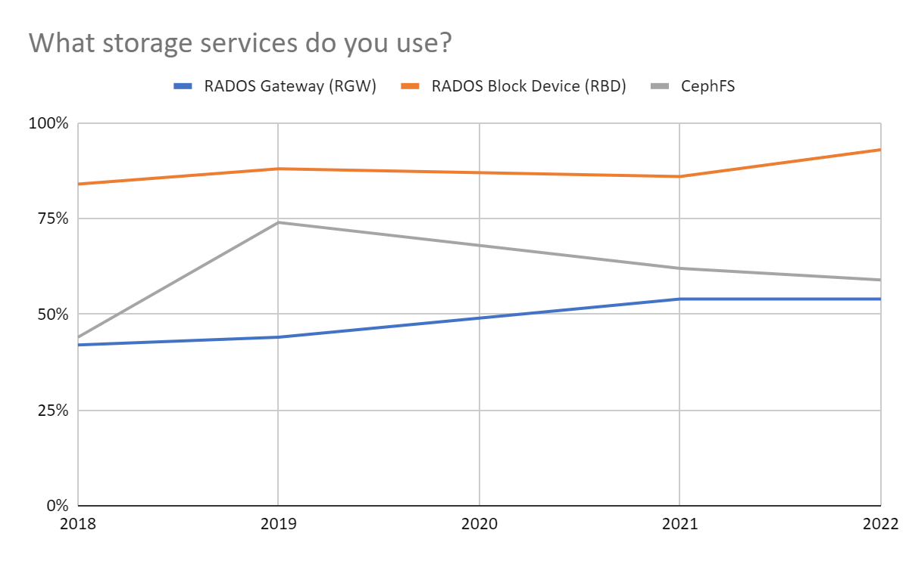

Each year,  members of the Ceph User Survey Working Group build a survey of
Ceph users and conduct the survey in the first calendar quarter of the
following year. The group chooses the questions which tend to be oriented
toward better understanding how people use Ceph, what they like about it, what
needs improving, and what new features ought to be prioritized. The survey, the
conducting of the survey, and the analysis of the results are all done in ways
that are aligned to the ideals of the open source community. You can find the
survey and results [on the Ceph website](https://old.ceph.com/user-survey/)
along with past results and analysis. We don’t cover the full survey in detail
here but instead provide some interesting highlights and analysis.  (Needs an
intro to what the survey is all about, how and when it was conducted..)

## People are happier with Ceph than ever

Ceph users are happier with the software. The Net Promoter Score ticked up
again, another two points on Ceph overall between the previous year and this
one, to 49. If you make some assumptions about which users are paying for
a supported Ceph deployment from one of the vendors represented, that number
goes up to 67, a 37% difference in satisfaction between free users and paying
ones. Next year, maybe we should ask more explicitly about those who pay and
don’t so we can make fewer assumptions. As a product person I’d like to assert
the difference in experience and outcomes for users who have a relationship
with Ceph experts. As a data person, I understand that it could also be
explained away as confirmation bias for the purchase decision. Next year, we
might ought to dig deeper into the data to tease that out.

## Nearly everyone is using Ceph for block storage?

When we ask whether you use a particular storage service, and then we count up
the responses of yes vs. no, we see a significant positive change for RADOS
Block Device. I speculate that this is related to the increase in usage of
Openstack and Kubernetes platforms that work well with Ceph's RBD.

An oddity between 2021 and 2022 is the change in respondents using Ceph to
provide multiple kinds of storage services. 10% more users reported delivering
two storage services with their ceph clusters in 2022 than 2021, but 5% fewer
reported delivering all three. Could it be related to the decline of CephFS and
increase over the years in RGW and market trends toward global collaboration
systems that tend to work nicely across hybrid storage implementations and
preferring to use S3?

## Faster uptake for Pacific vs. Octopus

When we took the survey last year, 48% had already adopted Octopus to some
extent.  We tend to take the survey around the same time each year, and we have
had consistently timed major releases (more or less) in the past. This year 60%
had already adopted some form of Pacific. It’s important to note that many of
those in both cases were running multiple versions of Ceph.

## Where did everybody go?

We had 127 responses to the user survey in 2022, which is a nearly 50% drop in
responses year over year. We looked at changes in respondent demographics year
over year across things like cluster size, geography, version of Ceph in use,
and others, and we did not find significant swings that would indicate
a particular population group that just didn’t respond this year. We have
several hypotheses for this, and the results blog might provide an interesting
forum for testing them out.

**Hypothesis A** - it was too long, and that’s what stopped a bunch of people
from tuning in. If you’re one of the people who didn’t respond, I’ve got
a [super-short survey for you here](https://survey.zohopublic.com/zs/OwD7RY)
- simple yes or no question - did you not respond because it was too long?

**Hypothesis B** - you didn’t take the survey because you didn’t hear about it.
We’ve gone hard and heavy trying to get notification of this post out to all
the major ways that people like to get communications (based on the survey
data) to try to reach you. Again, here’s an [extremely short
surve](https://survey.zohopublic.com/zs/wJD7oq)y where you can tell us whether
this contributed to your lack of response if you didn’t respond.

**Hypothesis C** - low motivation. It’s possible that people didn’t respond
because they don’t see the benefits of their perspectives reflected in the
priorities of the community. That may be more a problem of communication than
reality though, and so it’s important that the Ceph developers reflect back to
their community how they prioritize their activities. Here are just a few
examples from Josh Durgin of the way your feedback gets reflected in real
action

* Driven by community interaction, including data from the user survey, the
  Ceph engineering team has prioritized  development process improvements.
  Increased focus on reliability at scale included larger and more realistic
  scale testing for the Quincy release. Release candidates were published for
  users to try out and report issues before declaring a stable release.
* The survey influenced Red Hat hiring a technical writer to focus on enhancing
  documentation both in current and prior stable releases.
* Zac Dover and Anthony D’Atri, again influenced by past surveys, have both
  made improvements to Ceph documentation by themselves and through encouraging
  contributions by others.

Finally, the survey itself is driven by the community, for the community. I’d
love to see you on the next survey working group call so you can help make
a difference for the next one. You can join by adding your name
[here](https://tracker.ceph.com/projects/ceph/wiki/User_Survey_Working_Group).
